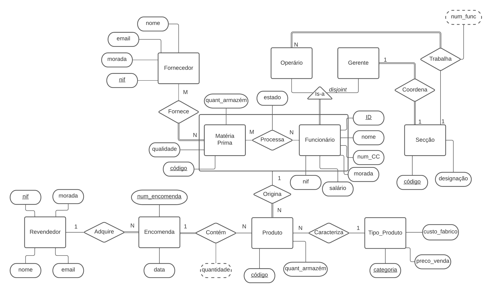
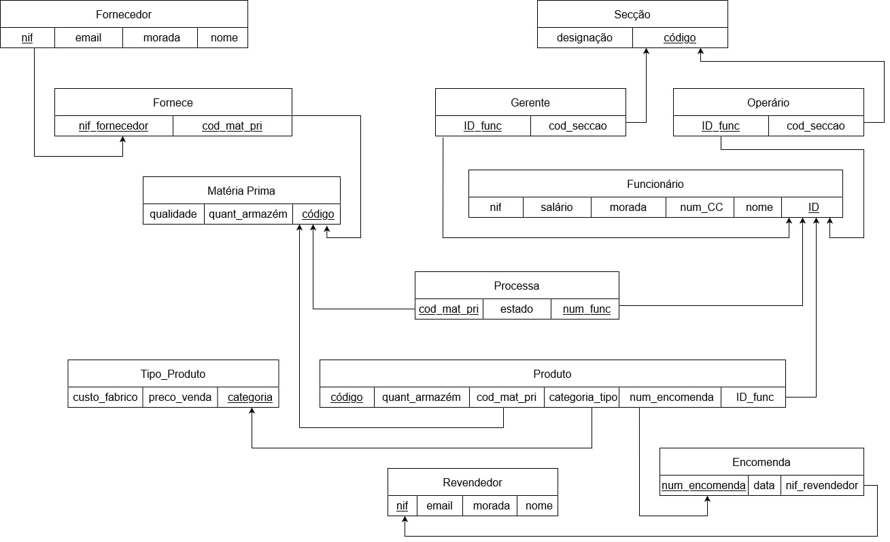

# BD: Trabalho Prático APFE

**Grupo**: P5G5
- Bárbara Nóbrega Galiza, MEC: 105937
- Miguel da Silva Pinto, MEC: 107449

## Introdução / Introduction
 
Este trabalho consiste na criação de uma base de dados para fazer a gestão de funcionários, secções, produtos, matéria-prima, encomendas, revendedores e fornecedores de uma empresa de fabrico de calçado.	Como foco principal, está a consulta do estado do processo de fabrico do calçado, que resulta da interação entre funcionário e matéria-prima. 

## ​Análise de Requisitos / Requirements

Uma empresa de calçado está organizada em secções. 
-	Cada secção tem uma designação e código únicos e deve ser possível saber o nº de funcionários que estão atualmente a trabalhar na mesma.
-	Os funcionários são de 2 tipos: operário ou gerente, sendo que se deve guardar os respetivos nomes, nº de CC, morada, nif, ID de funcionário e salário.
-	Cada secção exige que exista 1 gerente para a coordenar, assim como um funcionário só pode ser gerente se existir 1 secção. Além disso, cada funcionário deve trabalhar em uma das secções.
-	É permitido que uma secção apenas possua 1 funcionário, que será também gerente da mesma.
-	Os funcionários processam matéria-prima da qual se conhece a qualidade, quantidade em armazém e se atribui um código para a identificar.
-	De modo a que exista matéria-prima, é necessário a existência de pelo menos 1 fornecedor que é caracterizado por: nome, email, morada e nif.
-	Durante as várias fases do processamento da matéria-prima sabe-se o seu estado, e quando se atinge o estado final origina-se um produto. 
-	Tem que ser possível obter do produto informações como a quantidade de armazém e sua identificação através de um código. 
-	Cada produto é categorizado em um tipo de produto, o qual mantém a informação relacionada a categoria, preço de venda e custo de fabrico.
-	Uma encomenda, caracterizada por um número único e data, contém um ou mais produtos. Podem ser encomendados vários itens do mesmo produto, sabendo-se a quantidade de cada item encomendado. 
-	De maneira a que seja efetuada um certo nº de encomendas, é vital que exista um revendedor, caracterizado por: nome, email, morada e nif que as adquira.
-	Vários fornecedores podem fornecer a mesma matéria-prima, mas apenas um revendedor pode adquirir determinada encomenda.

## DER

## ER

