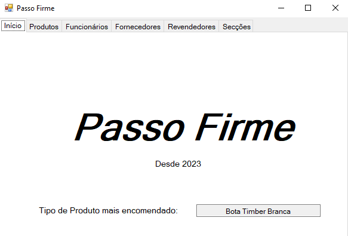
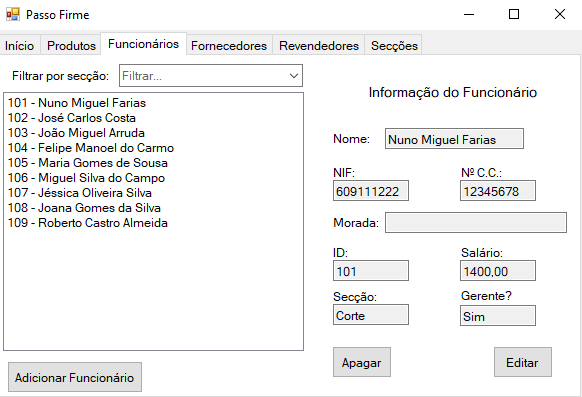
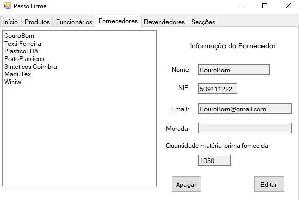
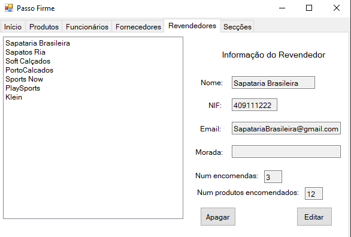
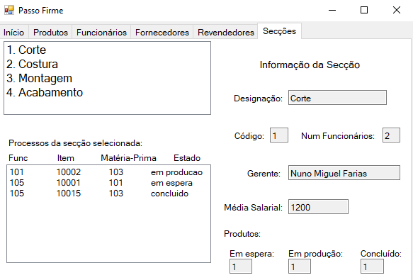

# BD: Trabalho Prático APF-T

**Grupo**: P5G5
- Bárbara Nóbrega Galiza, MEC: 105937
- Miguel da Silva Pinto, MEC: 107449


## Introdução / Introduction
 
- O tema do nosso trabalho é a gestão de uma empresa de calçado à qual demos o nome 'Passo Firme'.
- Criamos este projeto para que do lado da empresa seja possível gerir entidades como: produtos, funcionários, fornecedores e revendedores.
- É possível obter várias estatísticas acerca de cada entidade com foco nas que pertececem à empresa (com visualização extensa de cada secção e processamento de cada produto).
- De notar que 'Produto' refere-se a 1 item (exemplo: par de botas Timber Brancas 001), mas a visualização de estatísticas é feita por 'Tipo de Produto' (exemplo: Bota Timber Branca).


## ​Análise de Requisitos / Requirements
 
- Cada secção tem uma designação e código únicos, e é possível obter o nº funcionários que estão atualmente a trabalhar na mesma.
- Os funcionários são também classificados como: operário e/ou gerente, sendo que se deve guardar os respetivos nomes, nº de CC, morada, nif, ID de funcionário e salário.
- Cada secção exige que exista 1 gerente para a coordenar, assim como um funcionário só pode ser gerente se existir 1 secção. Além disso, cada funcionário deve trabalhar em uma das secções.
- É permitido que uma secção apenas possua 1 funcionário, que será também gerente da mesma.
- Em caso de uma secção ficar sem gerente, o operário com menor id de funcionário é eleito.
- Os operários processam matéria-prima da qual se conhece a qualidade, e o código de identificação. Pode-se calcular a quantidade em armazém.
- De modo a que exista matéria-prima, é necessário a existência de pelo menos 1 fornecedor que é caracterizado por: nome, email, morada e nif.
- Durante as várias fases do processamento da matéria-prima sabe-se o seu estado, e quando atinge-se o estado final origina-se um produto. Porém, nas fases anteriores já se sabe o produto que vai vir a ser gerado.
- Cada produto (item) possui um código único e um tipo.
- Tem que ser possível obter do tipo de produto informações como a sua categoria (denominação), custo de fabrico e preço de venda. 
- Uma encomenda, caracterizada por um número único e data, contém um ou mais produtos. Podem ser encomendados vários itens do mesmo tipo de produto. 
- De maneira a que seja efetuada um certo nº de encomendas, é vital que exista um revendedor, caracterizado por: nome, email, morada e nif que as adquira.
- Vários fornecedores podem fornecer a mesma matéria-prima, mas apenas um revendedor pode adquirir determinada encomenda.
- Cada fornecimento de matéria prima possui informação sobre a quantidade fornecida.

## APFE - melhorias no DER / ER

DER:
- A quantidade em armazém de um produto é agora um atributo calculado, o que faz mais sentido dada a abordagem descrita de 'produto'.
- A quantidade em armazém da matéria prima deixou de ser um atributo da entidade Matéria Prima, visto que faz mais sentido calcular essa quantidade a partir de cada fornecimento, que possui uma quantidade.
- O ato de processar um está agora ligado à entidade 'Operário' em vez de 'Funcionário. Faz mais sentido dado que o processamento é feito por operários e a entidade 'Gerente' pode apenas exigir a função de coordenar os operários (caso não seja o único 'Funcionário' na secção).
- A relação 'is-a' deixou de ser disjunta, ou seja, um 'Funcionário' pode ser um 'Gerente' e um 'Operário' ao mesmo tempo. Faz mais sentido dado que um 'Gerente' pode também ser um 'Operário' segundo os requisitos.
- A multiplicidade da relação Origina foi alterada de 1 Processa : N Produtos para 1:1. Percebeu-se que de cada processo orgina-se apenas um produto, pois cada produto é um item. 
- A obrigatoriedade da relação Origina foi alterada. Antes, era obrigatória apenas para o Produto, agora é obrigatória para ambos. Faz mais sentido pois um processo só existe se houver um produto a ser criado, que está a ser monitorado e cotado para fazer parte de uma encomenda.

ER: 
- Anteriormente, o produto estava ligado à matéria-prima, o que obrigava a cada produto ter apenas uma matéria-prima e produto era ligado ao funcionário, o que obrigava que apenas um funcionário trabalhasse naquele produto. Ambas ligações causavam situações indesejadas frente aos requisitos, por isso foram desfeitas. Para manter a relação de produto e essas entidades, foi importada a foreign key para a tabela Origina, que mantém as informações de cada processo.


## DER - Diagrama Entidade Relacionamento / Entity Relationship Diagram

### Versão final/Final version


## ER - Esquema Relacional / Relational Schema

### Versão final/Final Version


## ​SQL DDL - Data Definition Language

[SQL DDL File](sql/01_ddl.sql "SQLFileQuestion")

## SQL DML - Data Manipulation Language

Todas as queries foram feitas a partir de stored procedures, a fim de garantir uma camada de abstração entre a base de dados e o frontend da aplicação. Essa camada permite uma maior segurança (inserts, updates e deletes não poderão ser alterados diretamente no código) e uma maior facilidade caso futuramente se queira alterar a implementação interna de uma SP sem que se altere o frontend.

### Página Inicial 

Página inicial da aplicação, apenas mostra o produto mais encomendado.



Stored Procedures: 
- getCategoriaProdutoMaisEncomendado

### Página "Produtos" 

Página com a informação dos tipos de produtos. Para cada tipo, contém informações da tabela TipoProduto (preço de venda/compra, nome, código) e informações calculadas como o número existente de produtos daquele tipo e o número de encomendas que contém esse tipo de produto. Ainda é permitido adicionar um novo tipo e remover/atualizar um já existente.


Stored Procedures: 
- getTiposProduto
    - Utiliza UDFs: dbo.numProdutosPorTipo e dbo.numEncomendasPorTipo
- addProduto
- removeTipoProduto
- updateProduto

### Página "Funcionários" 

Página com a informação dos funcionários. Para cada funcionário, há um campo "gerente?" que indica se aquele funcionário é gerente ou não. Além disso, mostra o salário, nome, numCC, nif, id e secção. É possível adicionar, remover e atualizar.



Stored Procedures: 
- getGerentes
- getOperarios
- AddFuncionario
- RemoveFuncionario
- updateFuncionario

### Página "Fornecedores" 

Página com informações acerca dos Fornecedores associados à BD: nome, nif, email, morada e também um certo número que indica o total da Matéria-Prima fornecida à Passo Firme. Ainda é permitido remover/atualizar um Fornecedor.



Stored Procedures: 
- getFornecedores
- getMateriaPrimaFornecida
- removeFornecedor
- updateFornecedor

### Página "Revendedores" 

Página com informações acerca dos Revendedores associados à BD: nome, nif, email, morada e também um certo número de encomendas totais e o número total de itens encomendados nas mesmas. Ainda é permitido remover/atualizar um Revendedor.



Stored Procedures:
- getRevendedores
- removeRevendedor
- updateRevendedor
- getEncomendasRevendedor

### Página "Secções" 

Página com a informação sobre as 4 secções da fábrica. Para cada secção, contém informações como designação, id, num de funcionários que lá trabalham, seu gerente e a média salarial. Além disso, mostra o número de produtos em cada estado de processamento em tempo real, e uma lista indicando quais os processos que estão a correr. Para cada processo, é possível consultar o item a ser criado, o funcionário, a matéria prima e o estado.



Stored Procedures: 
- getSeccoes
    - Utiliza dbo.numFuncionariosSeccao
- getMediaSalarialBySeccao
- getProcessos

## Normalização / Normalization

As tabelas que constituem o esquema relacional previamente apresentado encontram-se na 3FN, pois atendem aos critérios da 1FN, da 2FN e não apresentam dependências transitivas (nenhum atributo não chave depende de outro atributo não chave).

Todas as tabelas que representam entidades apresentam chaves primárias e dependência funcional entre os atributos.
Exemplos: Fornecedor, MateriaPrima, Revendedor, Seccao, Funcionario, TipoProduto.

As restantes (as que fazem a ligação entre outras tabelas) utilizam chaves estrangeiras e têm chaves primárias compostas quando necessário.
Exemplos: Fornece, Encomenda, Gerente, Operario, Processa e Produto.

## Índices / Indexes

```sql
--Indexar os operários de cada secção e por ordem de código
CREATE CLUSTERED INDEX idx_operarioSeccao ON Empresa.Operario(codigo_seccao, ID_funcionario);
--Facilitará o acesso aos operários de cada secção para saber quem será o próximo gerente
--Não faz sentido indexar os gerentes pois são só 4 (1 por secção)

--Num cenário real, as Encomendas dos Revendedores têm centenas de produtos, assim como as matérias primas fornecidas, logo criamos os 2 índices abaixo:

--Indexar os produtos das encomendas de cada revendedor
CREATE INDEX idx_prodEncomenda_revendedor ON Empresa.Produto(num_encomenda)
WHERE num_encomenda IS NOT NULL;
--Indexa apenas os produtos que pertencem a uma encomenda (não os que estão em armazém)

--Indexar a matéria prima fornecida por cada fornecedor
CREATE INDEX idx_materiaPrima_fornecedor ON Empresa.Fornece(nif_fornecedor);
```

## SQL Programming: Stored Procedures, Triggers, UDF, Insertion Data, Indexes

[SQL SPs and Functions File](sql/02_sp_functions.sql "SQLFileQuestion")

[SQL Triggers File](sql/03_triggers.sql "SQLFileQuestion")

[SQL DB Init File](sql/04_db_init.sql "SQLFileQuestion")

[SQL Indexes File](sql/05_idx.sql "SQLFileQuestion")

## ​Outras Notas / Other Notes

A contribuição no desenvolvimento do projeto de cada membro do grupo foi igual.
Mudar ligação a base de dados: linha 45.
 